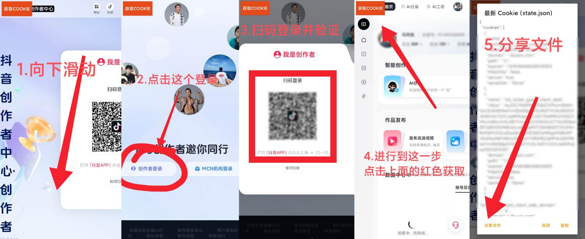

# Dycookie

一个**纯本地**的抖音 Cookie 获取工具（Android）。

> **无后门、无联网上传、无任何数据收集。**  
> 所有操作均在本地完成，生成的 `state.json` 仅保存在你手机本地，可直接分享文件。

## 功能说明

- 内置 WebView 打开抖音创作者中心（https://creator.douyin.com/）
- 使用桌面 UA，方便登录
- 登录成功后，点击左上角 **「获取COOKIE」** 按钮
- 自动提取当前 Cookie + localStorage
- 生成标准 `state.json` 格式（可直接用于 Playwright / Puppeteer 等工具）
- **自动保存为 state.json 文件**
- **支持直接分享文件**（可保存到文件管理器、发送到电脑等）
- 同时支持一键复制完整 JSON 到剪贴板

## 使用方法（v2.0）



**详细步骤：**

1. **向下滑动**  
   打开 APP 后，页面加载完成，向下滑动找到登录区域。

2. **点击「创作者登录」**  
   点击页面中的「创作者登录」按钮。

3. **扫码登录并验证**  
   使用手机抖音 APP 扫描二维码完成登录和验证。

4. **点击左上角红色「获取COOKIE」按钮**  
   登录成功并进入创作者中心后，点击左上角的红色 **获取COOKIE** 按钮。

5. **分享文件**  
   弹窗显示完整的 `state.json`，点击 **「分享文件」** 即可直接分享/保存 `state.json` 文件。  
   也可以点击「复制」将内容复制到剪贴板。

## 输出格式示例

```json
{
  "cookies": [
    {
      "name": "sessionid",
      "value": "xxxxxx",
      "domain": ".douyin.com",
      "path": "/",
      "expires": 1735689600,
      "httpOnly": true,
      "secure": true,
      "sameSite": "None"
    }
  ],
  "origins": [
    {
      "origin": "https://www.douyin.com",
      "localStorage": [
        {
          "name": "key",
          "value": "value"
        }
      ]
    }
  ]
}
```

## 安全声明

- **完全本地运行**：不请求任何第三方服务器
- **无后门**：代码开源，可自行审计
- **无数据上传**：提取的 Cookie 只会保存到本地并可由你主动分享
- **仅供个人学习研究使用**，请遵守相关平台服务条款

## 系统要求

- Android 5.0 及以上
- 需要允许「未知来源」安装

## 下载安装

推荐从 **Releases** 下载最新版本：

- **[下载 Dycookie v2.0 APK](https://github.com/SCARZQ/Dycookie/releases/download/v2.0.0/Dycookie-v2.0.APK)**（推荐）

或前往 Releases 页面查看所有版本：  
https://github.com/SCARZQ/Dycookie/releases

## 作者

- GitHub: [SCARZQ](https://github.com/SCARZQ)

## 许可证

本项目仅供学习与个人使用，禁止用于任何商业或违法用途。
